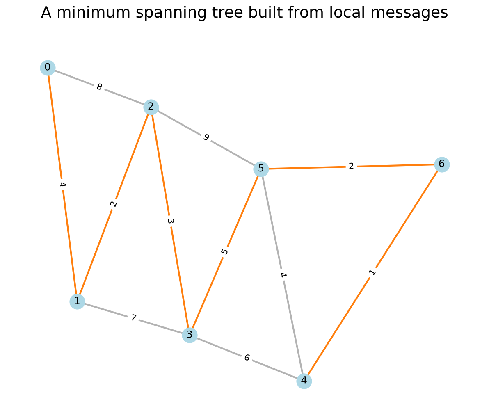
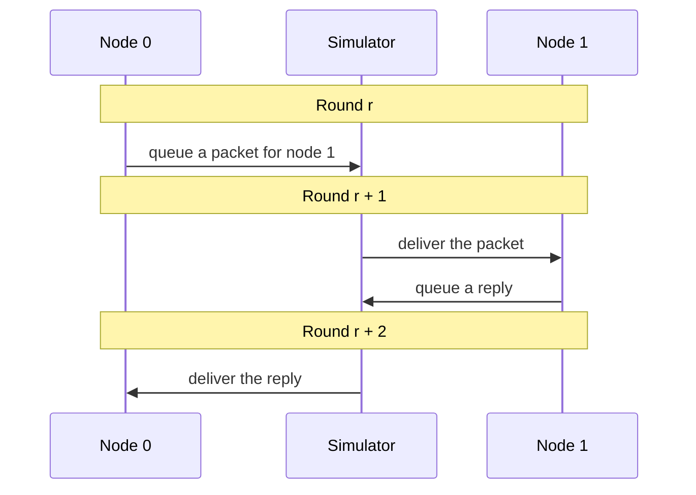

# dn-simulation

I wanted to see what graph algorithms actually do when every decision has to be
made by a node. In this simulator, a node starts with its own ID, its neighbors,
and the weights of its incident edges. Other nodes' state has to arrive in a
message.

The package provides the clock, message delivery, and CONGEST limits. The
algorithms live separately in `examples`, where their state and communication
are visible round by round.



*The `mst` example on a seven-node graph. Orange edges are the tree it selected;
gray edges were available but unused. This run took 58 rounds and 142 messages.
The image was rendered with the package's `draw_graph` helper.*

## A round in the simulator



Each node implements `AlgorithmNode.on_round(ctx, inbox)`. It can inspect its
local state and new messages, then queue messages for its neighbors. A packet
sent in round `r` arrives at the start of `r + 1`. Each directed link transmits
at most one packet per round; queued packets wait in FIFO order.

`SchemaCodec` packs each algorithm's messages into bytes. The simulator checks a
`128 * ceil(log2(max(2, n)))`-bit limit per message, including fixed-size
binary64 edge weights. It also records how many rounds ran, how many messages
were sent or dropped, and how many rounds each node was awake.

The default model is synchronous CONGEST. In sleeping CONGEST, a node can set its
own wake timer with `sleep_for(k)`. Messages that arrive while it sleeps are
dropped; incoming traffic does not wake it.

## Try it

This project uses Python 3.13 and [uv](https://docs.astral.sh/uv/getting-started/installation/).
From the repository root:

```sh
uv sync --locked
uv run --locked python -m examples.broadcast
uv run --locked python -m examples.mst
uv run --locked pytest
```

The examples can also be called from Python. Here a four-node path builds a BFS
tree and carries the largest node value back through it:

```python
import networkx as nx
from examples.bfs_max import run

result = run(nx.path_graph(4), source=0, values={0: 4, 1: 7, 2: 1, 3: 5})
print(result.node_results[3])
# {'parent': 2, 'distance': 3, 'children': (), 'maximum': 7.0}
print(result.rounds, result.sent_messages)
# 10 9
```

## Algorithms included

| Example | What the nodes work out |
| --- | --- |
| [`broadcast`](examples/broadcast.py) | A neighbor's ID or largest incident edge weight after a local exchange. |
| [`bfs_max`](examples/bfs_max.py) | A BFS tree, followed by a convergecast and broadcast of the largest node value. |
| [`leader_election`](examples/leader_election.py) | The minimum node ID through competing flood and echo waves. |
| [`mst`](examples/mst.py) | A minimum spanning tree through fragment searches and mutual merges. |
| [`sleeping_broadcast`](examples/sleeping_broadcast.py) | A local exchange after nodes choose when to wake. |

The MST protocol is the most involved example. A newly merged fragment waits
for acknowledgements across its branch tree before searching again, and tied
edges use the ordering `(weight, lower endpoint ID, higher endpoint ID)`. Its
starting point was an earlier notebook on the historical `ghs-mst-algorithm`
branch. [The examples guide](examples/README.md) covers the input assumptions
and results of each algorithm.

## Scope

The simulator accepts nonempty, simple, undirected NetworkX graphs with
nonnegative integer node IDs and finite edge weights. Some algorithms require
a connected graph. Weights are encoded as binary64 values, so integer weights
must be exactly representable; very large IDs can also exceed the message
budget. `Simulation.run()` stops when every node has finished or returns
`completed=False` at the configured round limit.

For the optional graph drawing helper, install Matplotlib with
`uv sync --locked --extra visualization` and run visualizations with
`uv run --locked --extra visualization`.
